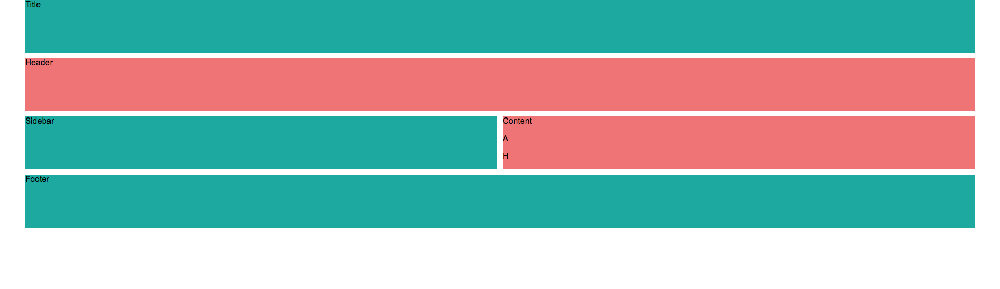

# CSS Grid

## Create a Grid

```css
.grid {
    display: grid;
    grid-template-columns: 1fr 1fr; /* defines two columns */
}
```

## Create Grid Areas

```css
  grid-template-areas: 
    "title title"
    "header header"
    "sidebar sidebar"
    "content content"
    "footer footer";
```

## Assign classes to grid areas

```css
.title {
    grid-area: title;
}

.header {
    grid-area: header;
}

.sidebar {
    grid-area: sidebar;
}

.content {
    grid-area: content;
}

.footer {
    grid-area: footer;
}
```

## Create a grid style for desktop

```css
@media screen and (min-width: 736px) {
    .grid {
        display: grid;
        grid-template-columns: 2% 1fr 1fr 2%;
        grid-template-rows: 1fr 1fr 1fr 1fr;
        grid-template-areas: 
        ". title title ."
        ". header header ."
        ". sidebar content ."
        ". footer footer .";
    }
}
```

## Screen Capture

